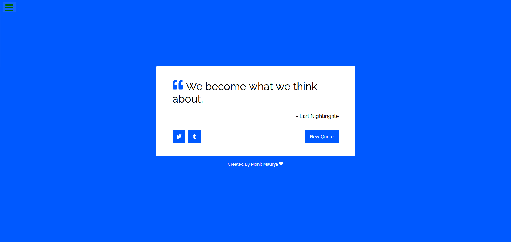

# Random Quote Generator

A simple React-based Random Quote Generator where you see a new random quote when you click "New Quote".

## Description

The Random Quote Generator project provides a minimalist interface to display random quotes. Clicking "New Quote" fetches a new quote from a predefined JSON file and updates the display.

This is the First Project of the .

## Installation

Follow these steps to install and run the project:

1. **Clone the repository:**
   ```sh
   git clone https://github.com/Mohit138928/random-quote-generator.git
   ```
2. **Navigate to the project directory:**
   ```sh
   cd random-quote-generator
   ```
3. **Install the dependencies:**
   ```sh
   npm install
   ```
4. **Update Quotes.js:**
   - Add the following URL in the `Quotes.js` file at line number 10:
     ```javascript
     const quotesUrl =
       "https://gist.githubusercontent.com/camperbot/5a022b72e96c4c9585c32bf6a75f62d9/raw/e3c6895ce42069f0ee7e991229064f167fe8ccdc/quotes.json";
     ```
5. **Install React Icons:**
   ```sh
   npm install react-icons --save
   ```
6. **Run the project:**
   ```sh
   npm run start
   ```

## Usage

1. **View Random Quotes:**
   - Click "New Quote" to fetch and display a new random quote.

## Preview of the Project



## Contributing

Feel free to contribute to this project. Any improvements or suggestions are welcome!

## License

This project is open-source and available under the [MIT License](LICENSE).

## Contact Information

If you have any questions or need further information, feel free to contact me at .
